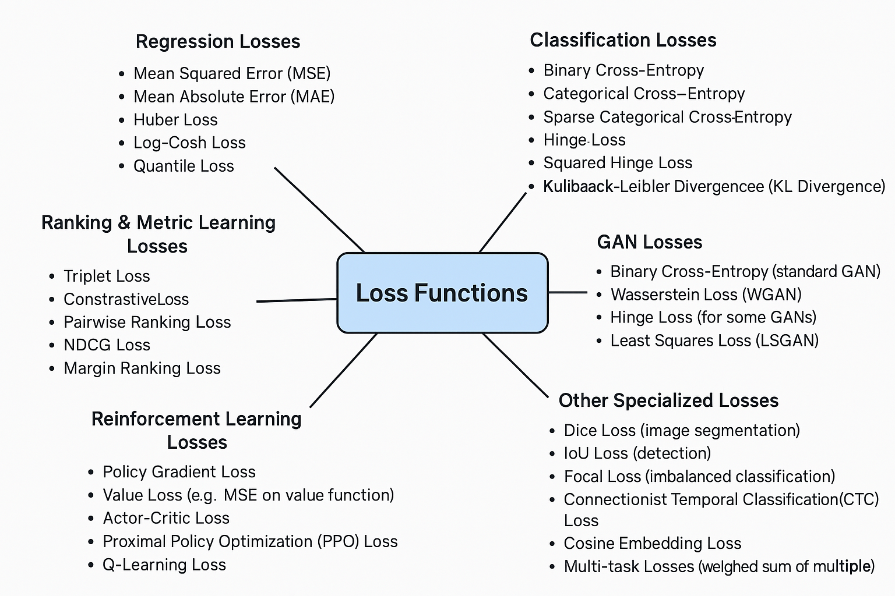

## Loss Function in Machine Learning

A **loss function** in machine learning is a mathematical function that measures the difference between a model’s predicted outputs and the actual target values. It quantifies how well a model is performing by calculating the error between predicted and actual values.

### Importance of Loss Functions
Loss functions are crucial for:
- **Training machine learning models**: They provide a measure of the model's performance.
- **Guiding optimization**: They direct the algorithm to adjust parameters to minimize loss and improve predictions.

----

### Loss Functions Examples

Several loss functions are commonly used in machine learning to evaluate model performance. Here are some examples:

#### 1. Mean Square Error (MSE) / L2 Loss
- **Use Case**: Regression tasks.
- **Description**: Calculates the average of the squared differences between the actual and predicted values.
- **Key Point**: Squaring the errors gives more weight to large errors, so MSE is very sensitive to outliers.
     -  when we say ***"very sensitive to outliers,"*** we mean that:\
        **Outliers** (***very large errors***) have a big impact on the MSE value.\
        This is because ***squaring even a single large error makes it much bigger*** (e.g., 10² = 100), which increases the total loss significantly.

#### 2. Mean Absolute Error (MAE) / L1 Loss
- **Use Case**: Regression tasks.
- **Description**: Measures the average of the absolute differences between the actual and predicted values.
- **Key Point**: Less sensitive to outliers than MSE 

----
[MSE And MAE, both explained](https://youtu.be/7oSh63dE_lE?si=jQBNiRgVdMVgE8j4)

----

#### 3. Binary Cross-Entropy Loss / Log Loss
- **Use Case**: Binary classification tasks.
- **Description**: Quantifies the difference between the predicted probabilities and the actual binary labels.
- **Equation**: $$L(y, f(x)) = -[y \log(f(x)) + (1 - y) \log(1 - f(x))]$$, where \( y \) is the actual label and \( f(x) \) is the predicted probability.

#### 4. Categorical Cross-Entropy Loss
- **Use Case**: Multi-class classification tasks.
- **Description**: Measures the difference between the predicted probability distribution and the actual distribution of classes.

#### 5. Hinge Loss
- **Use Case**: Classification tasks, particularly in support vector machines (SVMs).
- **Description**: Focuses on the margin between different classes and penalizes predictions that do not meet a certain threshold.

#### 6. Huber Loss
- **Use Case**: Regression tasks.
- **Description**: Combines the benefits of MSE and MAE. Uses a quadratic loss for smaller errors and a linear loss for larger errors.
- **Key Point**: Less sensitive to outliers than MSE but does not completely ignore them like MAE.

-----
Here is a visual map of most of the loss functions:

