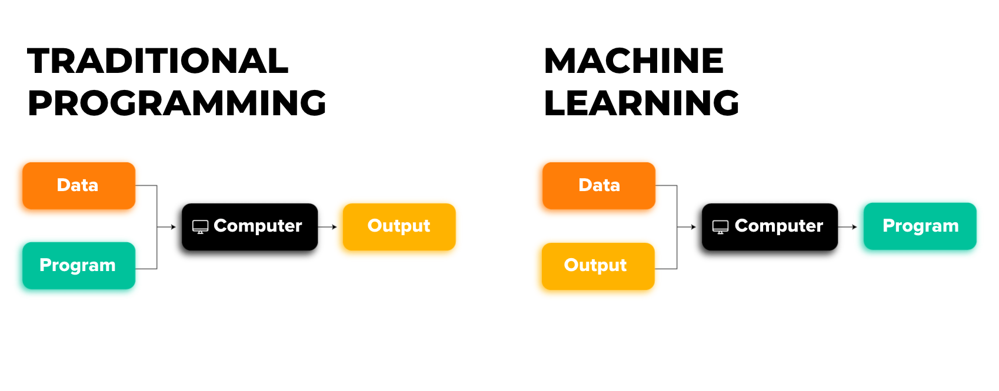

## What is Machine Learning?

Machine Learning is a subset of **Artificial Intelligence (AI)** that focuses on building systems that can learn from data and improve their performance over time without being explicitly programmed. Instead of writing rules for a computer to follow, ML algorithms use data to "learn" patterns and make predictions or decisions.
 - *Example:*
    ***This image compares Traditional Programming and Machine Learning (ML) approaches.***
    


    ---

    ## Traditional Programming

    - **Input:** Data and Program
    - **Process:** In traditional programming, you write explicit instructions (code/program) that tell the computer exactly how to process the input data.
    - **Output:** The computer follows these instructions to produce the desired output.

    ### Example:
    If you want to calculate the sum of two numbers, you write a program like this:
    ```python
    sum = a + b
    ```
    The computer uses the input data (`a` and `b`) to produce the output (`sum`).

    ---

    ## Machine Learning

    - **Input:** Data and Output
    - **Process:** In ML, you feed the computer both the input data and the expected output (labeled data). The computer uses this information to automatically generate a program (model or algorithm) that maps inputs to outputs.
    - **Output:** The program (model) generated by the computer can then be used to make predictions or decisions on new, unseen data.

    ### Example:
    If you want a machine to predict housing prices:
    1. **Input:** Historical data like the size of houses and their prices (features and labels).
    2. **Output:** The computer creates a model that learns the relationship between house size and price, enabling it to predict the price of a new house based on its size.

    ---

    ## Key Differences

    | **Aspect**                | **Traditional Programming**                      | **Machine Learning**                            |
    |---------------------------|--------------------------------------------------|-------------------------------------------------|
    | **Inputs**                | Data + Program                                   | Data + Output                                   |
    | **Output**                | Output                                           | Program (Model)                                 |
    | **Role of the Developer** | Defines rules explicitly                         | Provides data and allows the computer to learn  |

    ---

 


---


### Key Idea:
- **Learning from Data**: ML models learn patterns from historical data and use those patterns to make predictions on new, unseen data.
- The more opportunities you will give learning algorithm(model) to learn the better it perform . Basically here we talking about more data .


---

### Ml has two major types : Supervised and Unsupervised learning , both explained in separate files
---

## What are featues?
- Feature is an individual measurable property or characteristic of the data. (basically features are what we calling x or input) 
- Also referred to as independent variables(as they are independent of everything unlike label(y) which are dependent on feature/features(we can also say input or x)), predictors, or input variables
   - Why we call them predictors : Because they are the input variables used by a machine learning model to predict an outcome(output can also be referred to as  y , target variable , or label) . They Influence the Target Variable (y) in some way. 
   - Example: In predicting house prices, the size of the house and location influence the price, making them predictors.

- Features contain patterns and relationships that help in determining the output

- The quality of predictors (features) directly impacts how well a model can perform on unseen data . 
- If poor predictors are used, the model may not generalize well(means it may perform well on training data but may not perform well on unseen(testing) data).

### What Does 'Discrete' Mean?
The term discrete refers to values that are countable, distinct, and separate. In other words, discrete values cannot be broken down into smaller fractions (unlike continuous values).

#### 1. Discrete in General Terms
- Discrete values are ***fixed***, ***distinct*** numbers that do not take infinite values between them.
- Example: The number of students in a class (10, 20, 30—not 10.5 students).

#### 2. Discrete in Machine Learning
- In ML, **"discrete"** is commonly used in the context of labels, variables, and data types:

##### **A. Discrete Labels (Categories/Classes)**
When we say discrete labels, we refer to classification problems where the target variable (y label) has a finite set of values (categories).
   - Example:
       Spam Detection: Labels → {Spam, Not Spam} (Two discrete categories)
      Sentiment Analysis: Labels → {Positive, Neutral, Negative}

##### B. Discrete Features (Variables)
Discrete features are numerical variables that take only specific whole values (not continuous).
Example:
Number of pets → {0, 1, 2, 3, ...}
Shoe sizes (in whole numbers) → {5, 6, 7, 8, 9}

3. #### Discrete vs Continuous Data

##### Discrete vs Continuous Data

| Type               | Definition                                       | Example                                              |
|--------------------|------------------------------------------------|------------------------------------------------------|
| **Discrete Data**   | Can only take **specific values**, not in fractions | Number of students, dice rolls (1, 2, 3, 4, 5, 6)   |
| **Continuous Data** | Can take **any value within a range**          | Height (5.7ft, 6.2ft), Temperature (22.5°C, 30.1°C) |


**Some common terminologies used in Machine Learning** - [See this video clip by Andrew ng](https://youtu.be/dLc-lfEEYss?si=O79TZU4lOysG9fnk&t=384)
-  The dataset that used to train an Ai model is called **training set** 
- x = *input* variable (*feature*(or *input feature*) and other fancy names)

- y = *output* variable/*target* variable and obviously other fancy names . 

The main thing is concept !!

- The Data set has one specific row for one specific example(also called ***Data Sample***)(which includes input and its corresponding output) . ***In Ai/Ml we basically we represent dimensions of data in columns, and vector components each row***. 
```
           x  |  y
    ex1-input |  ex1_output
    ex2-input |  ex2_output
```
So basically each row represents different training example . 
**Total no. of rows in data set is represented by m** here m = 2
,we can say here we have total 2 training examples . 

- To indicate single training example: We use notation **(x,y)** 
***Example: (ex1-input,ex1_output)***
- ***Can also write like this based on usecase***
***(x<sup>(i)</sup>,y<sup>(i)</sup>)***  = 
***(ex1-input,ex1_output)*** . 
    - So consider this notation as some index in dataset.

