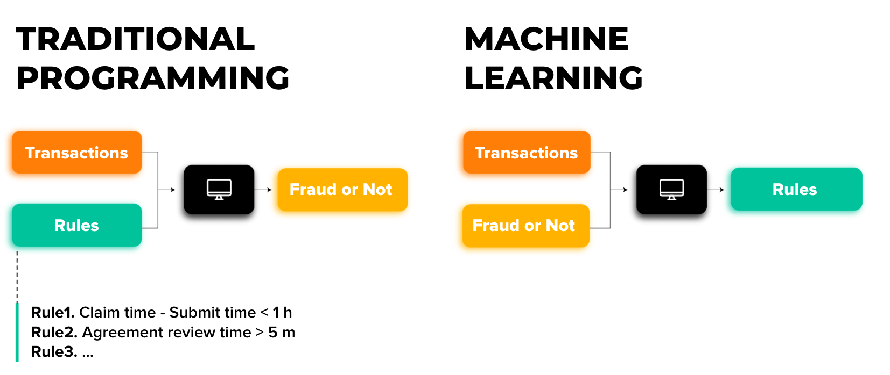

## What is Machine Learning?

Machine Learning is a subset of **Artificial Intelligence (AI)** that focuses on building systems that can learn from data and improve their performance over time without being explicitly programmed. Instead of writing rules for a computer to follow, ML algorithms use data to "learn" patterns and make predictions or decisions.
 - *Example:*
    ***This image compares Traditional Programming and Machine Learning (ML) approaches.***
    


    ---

    ## Traditional Programming

    - **Input:** Data and Program
    - **Process:** In traditional programming, you write explicit instructions (code/program) that tell the computer exactly how to process the input data.
    - **Output:** The computer follows these instructions to produce the desired output.

    ### Example:
    If you want to calculate the sum of two numbers, you write a program like this:
    ```python
    sum = a + b
    ```
    The computer uses the input data (`a` and `b`) to produce the output (`sum`).

    ---

    ## Machine Learning

    - **Input:** Data and Output
    - **Process:** In ML, you feed the computer both the input data and the expected output (labeled data). The computer uses this information to automatically generate a program (model or algorithm) that maps inputs to outputs.
    - **Output:** The program (model) generated by the computer can then be used to make predictions or decisions on new, unseen data.

    ### Example:
    If you want a machine to predict housing prices:
    1. **Input:** Historical data like the size of houses and their prices (features and labels).
    2. **Output:** The computer creates a model that learns the relationship between house size and price, enabling it to predict the price of a new house based on its size.

    ---

    ## Key Differences

    | **Aspect**                | **Traditional Programming**                      | **Machine Learning**                            |
    |---------------------------|--------------------------------------------------|-------------------------------------------------|
    | **Inputs**                | Data + Program                                   | Data + Output                                   |
    | **Output**                | Output                                           | Program (Model)                                 |
    | **Role of the Developer** | Defines rules explicitly                         | Provides data and allows the computer to learn  |

    ---

 



---


### Key Idea:
- **Learning from Data**: ML models learn patterns from historical data and use those patterns to make predictions on new, unseen data.
- The more opportunities you will give learning algorithm(model) to learn the better it perform . Basically here we talking about more data .


### Supervised learning : 
Supervised learning refers to algorithms that learns X to Y  or we can also say Input to Output mappings.The key characteristics of supervised learning is that you give your learning algorithms , **examples** to learn from , that includes the right answers , whereby right answers means here correct label Y for a given input X and by seeing correct pairs of input X and desired output label Y that learning algorithm eventually learns to take just the input alone without the output label and gives us reasonable accurate prediction or guess of the output , 
Example : https://youtu.be/sca5rQ9x1cA?si=x5hcOOdTOfFomfpT&t=64