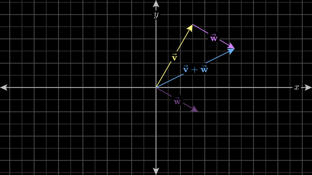
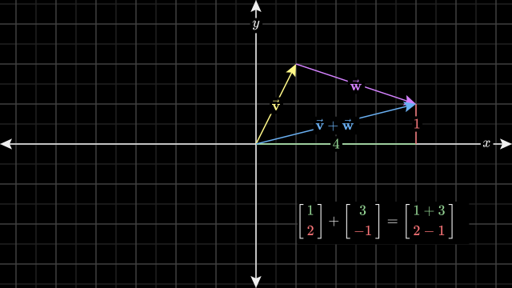

# Vectors
  - *Vectors are fundamental building block of linear algebra*

  **But What Vectors are?** 
  - Well , Vectors are ordered lists of numbers representing magnitude and direction in space. They can be 1D (scalars), 2D, 3D, or n-dimensional. Used in ML for representing data, features, gradients, and transformations.

## Read this by 3blue1brown , it covers your lot of topics related to vectors(Basically about interpretations of vectors) :
https://www.3blue1brown.com/lessons/vectors

## Summary and Main things to remember 
### 1. Coordinates of vectors : 
 - Coordinates of a vector are a pair of numbers that basically give instructions for how to get from the tail of that vector at the origin, to its tip
   - The first number tells you how far to walk along the x-axis
     - positive numbers indicating rightward motion and negative numbers indicating leftward motion
   -  second number tells you how far to then walk parallel to the y-axis
      - positive numbers indicating upward motion, and negative numbers indicating downward motion 
- To distinguish vectors from points, the convention is to write this pair of numbers vertically with square brackets around them. 
- Every pair of numbers gives you one and only one vector, and every vector is associated with one and only one pair of numbers.
- In three-dimensions, you add a third axis, called the *z-axis* which is perpendicular to both the 
*x* & *y* axis  , in this case every triplet of numbers gives you one unique vector in space, and every vector in space gives you exactly one triplet of numbers.

### 2. Vector Addition :
 -  Let's say we have two vectors, one pointing up and a little to the right, and another pointing to the right and a little bit down.
    - To add these two vectors, move the second vector so that it's tail sits on the tip of the first one. Then if you draw a new vector from the tail of the first one to where the tip of the second now sits, that new vector is their sum.
    
      - Why is this a reasonable thing to do? Why this definition of addition and not some other? Well, one way to think about it is that each vector represents a certain movement; a step with a certain distance and direction. If you take a step along the first vector, then take a step in the direction and distance described by the second vector, the overall effect is the same as if it just moved along the sum of those two vectors.
      - In fact, let's see how vector addition looks numerically. The first vector 
        here has coordinates:

       ```
       [ 1 ]
       [ 2 ]
       ```

       and the second has coordinates:

       ```
       [ 3 ]
       [-1 ]
       ```

       When you take their vector sum using this tip-to-tail method, you can think of a        four-step path from the tail of the first to the tip of the second:

       Walk **1** to the right, then **2** up, then **3** to the right, then **1** down.

      -  Reorganizing these steps so that you first do all the rightward motion, then all the vertical motion, you can read it as saying first move 1 + 3 to the right, then move 2 - 1 up. So the new vector has coordinates 4 and 1.
      

      Addition of vectors : 
      ```
       [ x1 ]  +  [x2]  = [x1+y1]  
       [ x2 ]     [y2]    [x2+y2]
       ```

### 3. Vector Scaling :
The other fundamental vector operation is multiplication by a number. This is best understood by just looking at a few examples. 
- If you take the number 2,  and multiply it by a given vector, you stretch out that vector so that it's two times as long as when you started.

- If you multiply a vector by 1/3 , you squish it down so that it is one-third its original length.
- If you multiply it by a negative number, like -1.5 then the vector gets flipped around, then stretched out by a factor of 1.5

*This process of stretching, squishing, and sometimes reversing direction, is called **"scaling."***
And these numbers which scaling the vector therefore are called to be **scalars**. 

Scaling of Vecotor `v` by `n`  (where n is a scalar and v is a vector )  (`*` We are taking this as multiplication sign instead of dot)

      
      n*v = n * [ x ]  = [n*x]  
                [ y ]  = [n*y]
       
