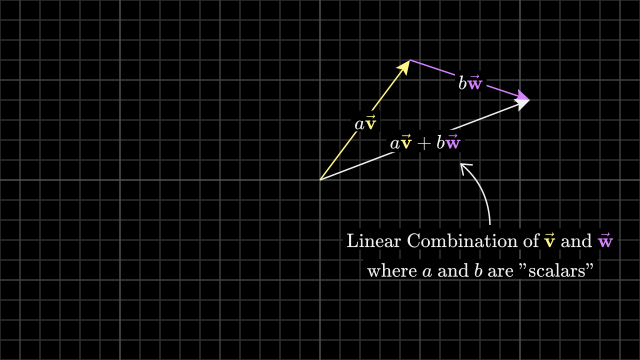
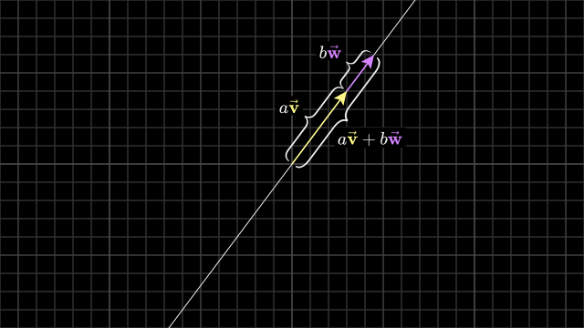
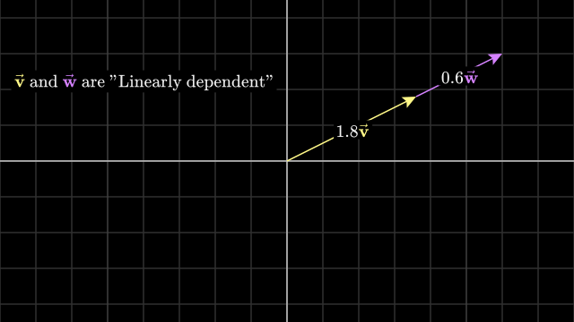
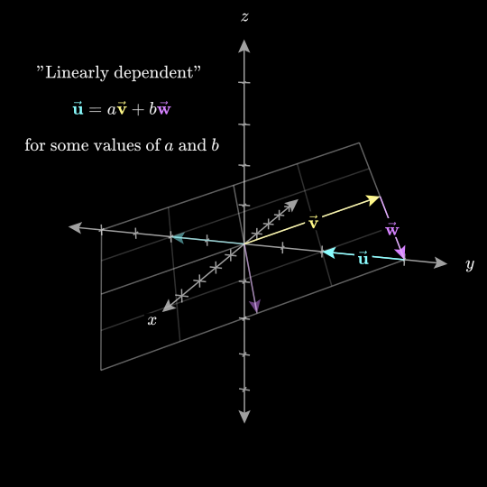
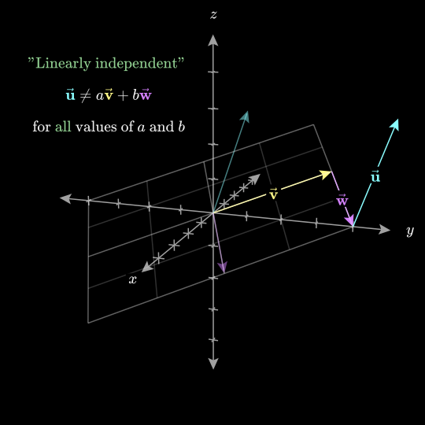

# Read this , to deep dive in topics of linear_combination / span / basis of vectors by `3blue1brown`: 
https://www.3blue1brown.com/lessons/span 

## Summary and Main things to remember , thing we not understand
### 1. How to visualize vector coordinates :
- So When you have a pair of numbers meant to describe a vector, like (3,-2)  think of each coordinate as a scalar, meaning think about how each one stretches or squishes vectors.

- In the x-y coordinate system, there are two special vectors. The one pointing to the right with length 1 commonly called "i hat" or "the unit vector in the x-direction". The other one is pointing straight up with length 1 commonly called "j hat" or "the unit vector in y-direction".
  - Now, think of the x-coordinate as a scalar that scales `i-hat` stretching it by a factor 3 and the y-coordinate as a scalar that scales `y-hat`  flipping it and stretching it by a factor of 2 . 
  - In this sense, the vector that these coordinates describe is the sum of two scaled vectors. New vector produce by these two vectors is (3,-2) 
- `i-hat` and `j-hat` has special name :  "basis" of the coordinate system
  - this means is that when you think about coordinates as scalars, the basis vectors are what those scalars actually scale : -> Example: 
  
    ```
    [-6] = (-6)i + (3)j   {i and j are "i-hat" and "j-hat" respectively}
    [3]
    ```
   
### 2. Linear Combinations :
- Any time you're scaling two vectors and adding them like this, it's called a "linear combination" of those two vectors. 


-  Multiplying every real number by the vector produces an infinite line that passes through the origin and the point defined by the vector. Its because every multiples of particular vector lies on the same line . As for example : 2v , 1/3v , -5v , 7v , just change the magnitude and direction of that vector but all those multiples still produce the same line(or we can also say be on the same line) . 

- So a linear combination of n vectors is a method of combining n lines 

- For most pairs of 2D vectors, if you let both scalars range(scale) freely and consider every possible vector you could get, you will be able to reach every possible point on the plane . Every two-dimensional vector is within your grasp.
- However, if your two original vectors happen to line up (like as shown in below image), the lines produced by the scalar multiplication will be the same line (as multiples of every vector lies on the same line), so adding them together can't yield a vector outside of that line (it produce resultant vector on the same line in which those two vectors (that are on the same line) exist)

- third possibility exist too: Both your vectors could be the 0 vector(whose magnitude is 0) , in which case you'll just be stuck at the origin. 

### 3. Span
- The set of all possible vectors you can reach with linear combinations of a n amount of vectors is called the "span" of those n amount of vectors. 
- the span of most pairs of 2D vectors is all vectors in 2D space, but when they line up, their span is all vectors whose tip sit on a certain line.
- The span of n vectors is basically a way of asking what are all the possible vectors you can reach using two fundamental operations -  vector addition and scalar multiplication.

### 4. Collinearity of Vectors (To check if n vectors lies on the same line or not)
## Definition

Two vectors are collinear if they lie on the same line. This can be determined using two methods:

---

## **1. Component Ratios Method**
If the ratios of the components of two vectors match, the vectors are collinear.

### Example:
Let the vectors be:
**v = [3, 2]** and **w = [-1, -2]**

Check the ratios of their components:

`3 / -1 = -3`, and `2 / -2 = -1`

Basically we doing this above - `v1 / w1 = v2 / w2` if yes , vectors are collinear 

**Note : Use this method only If `w1, w2 ≠ 0`.**

The ratios do not match, so the vectors are not collinear.

---

## **2. Scalar Multiples Method**
### What are Scalar Multiples?
A multiple of something is the result of multiplying it by a scalar (a constant). For example:
- Multiples of `3` are `3`, `2×3=6`, `3×3=9`, and so on.
- Similarly, for vectors, scalar multiples are obtained by multiplying all components of that vector by the scalar. 

### Some Properties:
- All scalar multiples of a vector lie on the same straight line passing through the origin and a point defined by the vector.
- This can also be verified programmatically by plotting graphs.
- The set of all scalar multiples of given vector is called span of that given vector . It represents all points on line defined by that vector .

### Example:
If **v = [1, 2]**, then:

2v = [2, 4], -1v = [-1, -2]

All these vectors lie on the same line.

---

## **Key Rule for Collinearity**
Two vectors are collinear if one is a scalar multiple of the other.

### Formula:
If there are two vectors:
v = [v1, v2], w = [w1, w2]
then , if we take `w = kv` (or `v = kw` , **for now take `w=kv`**)(where k is constant) , then vectors v and k are said to be collinear(means both v and w lies on the same line , and vectors produced by these two vectors also lies on that same line , we already talk about this how this happens )

this further gives us this formula `k = w/v`  , then :
```
[w1] = k * [v1]
[w2]       [v2]
```
which gives : 
```
w1 = kv1 
          (we simply multiply `v` both components by scalar `k`)
w2 = kv2
```
which gives : 
```
w1\v1 = k
w2\v2=k
(now if the values of both `k` will come same , that means our `v` and `w` are collinear otherwise not)
```
        
        
    and from here our component ratios method comes 
    because if `RHS = RHS`
    Then its obvious to say , `LHS = LHS` too . 
    which gives us here same component ratios thing:
    *w1/v1 = w2/v2* (If yes vectors are collinear)

### 5. Vectors vs Points (I recommend is to read about this from that link i provided at top) 
- Btw main thing here to remember is , we can treat vectors as points , the vector points ,  is at the tip of that vector 
- In general, if you're thinking of a vector on its own, think of it as an arrow, and if you're thinking of a collection, it's convenient to think of them as points

### 6. Span in 3D(I recommend is to read about this from that link i provided at top)
Main things are: 
-  A linear combination of three vectors is defined pretty much the same way as for two: Choose three scalars, use them to scale each of your vectors, then add them all together. And again, the span of these vectors is the set of all possible linear combinations.


- The Vector pointing to the 3rd axis with length 1 commonly called "k hat" or "the unit vector in the z-direction".

###7. I-hat , J-hat , K-hat representation , respectively
```
[1]                     [0]                     [0]
[0]                     [1]                     [0]
[0]                     [0]                     [1]
```

### 7. Linearly Dependent vs Linearly Independent(You can read about this also from that link)
Important thing:
- In the case where the third vector was sitting on the span of the first two, or the case where two vectors happen to line up, we want some terminology to describe the fact that at least one of these vectors is redundant, not adding anything to our span. Whenever this happens, where you have multiple vectors, and you could remove one without reducing their span, the relevant terminology is to say they are “linearly dependent”.
   
  
   - Another way of phrasing this would be to say that one of the vectors can be expressed as a linear combination of the others. That is, it's already in the span of the other two.
  
- On the other hand, if each vector really does add another dimension to the span, they are said to be “linearly independent”.

  
 