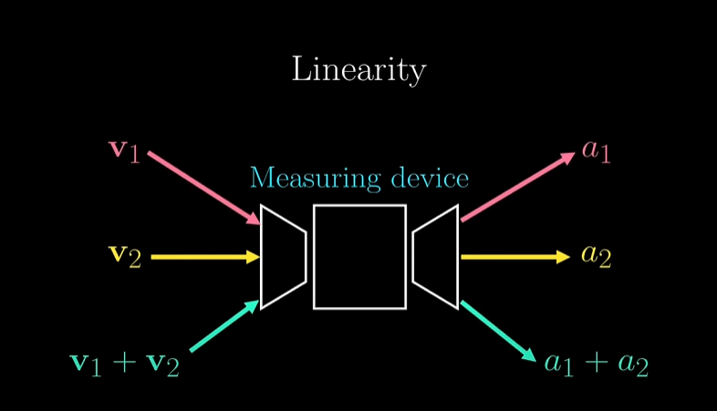
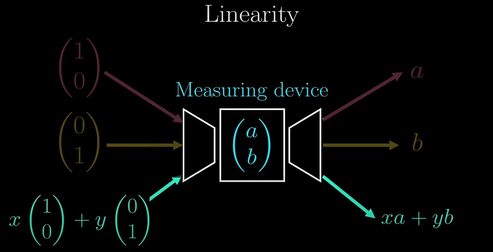

# Its important to see where it used in Ai/Ml

***Matrix transpose is widely used in AI and machine learning, 
for various operations and transformations. 
It is particularly useful for efficiently calculating distances,
between data points, which is vital for tasks like image recognition.Additionally, 
the transpose operation helps in adjusting and analyzing data in different formats,
allowing transformations between different orientations, such as from portrait to landscape.
In neural networks, matrix transpose is used to process weights and inputs of different sizes 
where the dimensions do not meet the requirements for matrix multiplication,
providing a way to "rotate" one of the matrices to comply with multiplication requirements.
This is especially important in backpropagation, where the transpose 
of a matrix is used instead of the inverse to compute gradients efficiently.***


----

## All properties of transpose 
[See this](https://youtu.be/wjYpzkQoyD8?si=XZctLx512ZvrEf8p&t=110)

## A matrix transpose is just swapping its rows and columns 

[Example](https://youtu.be/wjYpzkQoyD8?si=jYPPvSGPT661sZ78&t=80)

- We start with ***covectors (also called a dual vector)*** : ***Covectors*** are basically a machine that will eat a vector and output a number. We can also call it measuring device `as it measures the vector`.These are special devices in that they are linear.
That means if you have two vectors $\vec{v_1}$ and $\vec{v_2}$, and they are measured by this machine to be $a_1$ and $a_2$, then this machine will measure $\vec{v_1} + \vec{v_2}$ to be $a_1 + a_2$.



And if you scale $\vec{v1}$ instead of adding $\vec{v1}$ by $\vec{v2}$, say by some $\lambda\cdot\vec{v1}$
then it will measure to be $\lambda\cdot a_1$

- Linear Nature of Co-vectors
1. The phrase "linear" means that co-vectors respect two important properties:
    - Additivity: If you have two vectors, a co-vector applied to their sum is the same as applying it to each vector individually and then adding the results.
    - Homogeneity: If you scale a vector (multiply it by a scalar), the co-vector will scale the result by the same amount.


[A good analogy](https://youtu.be/g4ecBFmvAYU?si=Dnm2-RGafJ89-Nqj&t=110)

- A matrix at its core is a summary of a linear map (already know this)
    - The terms "linear map" and "linear transformation" are used interchangeably in mathematics and linear algebra.
 Both refer to a mapping between two vector spaces that preserves the operations of vector addition and scalar multiplication.
This means that for any vectors $\vec{v_1}$ and $\vec{v_2}$ in the domain vector space $V$ and scalars $a$ and $b$ from the underlying field, the following properties hold:

- Additivity: $T(\vec{v_1} + \vec{v_2}) = T(\vec{v_1}) + T(\vec{v_2})$
- Homogeneity: $T(a\vec{v_1}) = aT(\vec{v_1})$
(where $T$ is a linear transformation)

Example algebraically:
$\alpha$ and $\alpha^*$ (where $\alpha^*$ is the transpose of $\alpha$)


Example matrix:
```math
A = \begin{bmatrix}
1 & 2 & 3 \\
4 & 5 & 6 \\
\end{bmatrix}
\rightarrow 
A^T = \begin{bmatrix}
1 & 4 \\
2 & 5 \\
3 & 6 \\
\end{bmatrix}
```

So the most big picture is that, ***transpose is just transforming some measurement device in other spaces to the same measurement device in the original space.***

------
[Visualize co-vectors](https://youtu.be/g4ecBFmvAYU?si=OBqrqCAonKqQQgb9&t=264)

- So just like linear map, in 2D its suffice to know what $\begin{bmatrix}1 \\ 0\end{bmatrix}$ and $\begin{bmatrix}0 \\ 1\end{bmatrix}$ are measured to be.

  - If the measurements are $a$ and $b$ respectively, so for our purpose lets say we have $\begin{bmatrix}a \\ b\end{bmatrix}$ covector

   -  Now if you take any vector $\begin{bmatrix}x \\ y\end{bmatrix}$ just be linearity it will be measured as $x \cdot \begin{bmatrix}1 \\ 0\end{bmatrix}$ + $y \cdot \begin{bmatrix}0 \\ 1\end{bmatrix}$

   - So it will me measured as $x \cdot a$ + $y \cdot b$. This is just of function of two varibales.
   - [Visualize this](https://youtu.be/g4ecBFmvAYU?si=sRbZOSAAMcwge63U&t=319)



----

# How a Covector Measures a Vector

When we say that a covector measures a vector, we mean that it assigns a scalar value to the vector in a structured way. This is done using the dot product.

Let’s break this down step by step with an example.

## 1. Vectors vs. Covectors
A vector is something that has magnitude and direction in space.
A covector is a function that takes a vector and outputs a scalar (a single number).

Mathematically, a covector 
```math
(a, b)
```

acts on a vector
```math
(x, y)
```

using the dot product, to produce a scalar
```math
\text{covector} \cdot \text{vector} = ax + by
```
This gives a scalar, meaning the covector measures the vector.

So the function come is :
```math
f(a, b) \rightarrow ax + by \text{\space \space \space (where } (x, y) \text{ is a vector)}
```

## 2. Dot Product
Let's take a concrete example.

Suppose we have a vector
```math
\vec{v} = (3, 2)
```

And a covector
```math
w^T = (4,5)
```

The covector $w^T$ takes the vector $\vec{v}$ and produces a scalar
```math
w^T \cdot \vec{v} = 4 \cdot 3 + 5 \cdot 2 = 12 + 10 = 22
```
***A covector just assigns a number to the vector, saying:
"This vector belongs to level 22 in my measurement system $w^T$. "***

If we measure some other vector $\vec{u}$ with the same covector(means same measurement system(we can say scale also)) $w^T$, we get:
```math
w^T \cdot \vec{u} = 4 \cdot 1 + 5 \cdot 3 = 4 + 15 = 19
```
***"The measurement tells us that $\vec{v}$ belongs to level 22, and $\vec{u}$ belongs to level 19 in the measurement system defined by $w^T$. This means $\vec{v}$ has larger measurement(larger length) than $\vec{u}$. However, the fact that both dot products are positive does not necessarily mean that $\vec{u}$ and $\vec{v}$ point in the exact same direction—it only means they lie in the same general half-space(`A half-space is one side of a plane (in 2D) or a hyperplane (in higher dimensions`) defined by $w^T$."***


## 3. Geometric Interpretation
To understand this better, let’s visualize it:
- The vector $(3,2)$ is a point or arrow in 2D space.

- The covector $w^T$ defines a set of parallel lines where $ax + by$ is constant.(**And different covectors will have different set of parallel lines, with different directions and densities**)
    - [See this clip for visualize more better](https://youtu.be/g4ecBFmvAYU?si=Hnt_lObFaTDl4086&t=380)
    - **A covector $w^T = (a,b)$  defines a set of parallel lines because it assigns the same scalar value to all vectors $\vec{v} = (x,y)$ that satisfy the equation $ax + by = c$. (***where $c$ is some constant***)**
     -  ### Again Why Are These Lines Parallel?
          - Each choice of $c$ gives a different line.
          - The direction of the normal vector $(a,b)$ remains the same for all such lines, which means they never intersect and are parallel.
          - As $c$ changes, the whole line shifts up or down, keeping the same slope $-\frac{a}{b}$.
            - Example:
                - For $w^T$ = $(4,5)$,  the equation becomes:
                  ```math
                   4x + 5y = c
                  ```
                - If  $c$ is 22, one line is $4x + 5y = 22$
                - If $c$ is 19, one line is $4x + 5y = 19$
                - So If we change $c$, we shift to another parallel line
                - Since both lines have the same slope $-\frac{4}{5}$, they are parallel. (slope is negative, after solving for $y$) 
                - ## Geometric Meaning of above:
                  - A positive $a$ makes the slope more negative(in this example), meaning the line tilts downwards.
                  - A negative $a$ makes the slope positive(in this example), meaning the line tilts upwards. 
                  


- ***For example***, the equation $4x + 5y = 22$ defines a line where all vectors have the same measurement.
  - Because any point $(x+y)$ that satisfies $ax+by=c$ will always result in the same scalar value $c$ when measured by same covector ($w^T$). [See this clip to understand](https://youtu.be/g4ecBFmvAYU?si=nMN0jjii92VbtdZ8&t=373)
    - If you take a different vector ($x^\prime$,$y^\prime$) that satisfies $ax^\prime + by^\prime = c$, then:

     This means the covector gives the same measurement to every vector on this line(because $c$ is constant).
   

If we change the vector to $(1,1)$, the measurement is:
```math
4(1) + 5(1) = 4 + 5 = 9
```

This means $(1,1)$ belongs to a different level set than $(3,2)$.


### Key Takeaways

✔ A covector assigns a scalar to a vector via the dot product. 

✔ This measurement determines which level set the vector belongs to. 

✔ Covectors are dual to vectors: they don’t point but rather slice space into regions with equal values.


## 4. Real-World Analogy: Height of a Hill

Think of a topographic map:

- Vectors are like positions $(x, y)$ on the ground.

- The covector measures altitude at each position.

- The function $ax + by$ assigns a height to each point.

For example:

- If you walk in a direction that increases $ax+by$ you go up hill.

- If you walk in a direction that decreases $ax+by$ you go down hill.

If $ax+by$ is constant, you're walking on a flat contour line.

----

- [If we have any covector $(a,b)$ and we have some vector with same coordinates as this covector $\begin{bmatrix}a \\ b\end{bmatrix}$ ***then this vector will be $\perp$ to all the parallel lines defined by this covector***, and ***the longer that vector the denser that parallel lines are***, ***so we expect the length(of that vector) to be proportional to the density of the parallel lines***. If we have the gap size between the lines, then the density of the lines should be $\frac{1}{Gap size}$ - how many gaps could you fit in 1 unit ***and the length of that vector is exactly*** $\frac{1}{Gap size}$](https://youtu.be/g4ecBFmvAYU?si=5gKuyFjZklF4hawo&t=477)

[Find the corresponding covector(when not given) using the Gap size](https://youtu.be/g4ecBFmvAYU?si=_RSWelOvfvYXwMre&t=467)


----
$\vec{v}.\vec{x} = \vec{v}^T.\vec{x}$  - **But Only Sometimes**
[See this](https://youtu.be/wjYpzkQoyD8?si=2ZosojQVA1Wahmpq&t=297)

Linear Transformations not in general preserve the dot product.

----

[How can we preserve the dot product?](https://youtu.be/wjYpzkQoyD8?si=imdXej3tnm5UKDWu&t=421)
